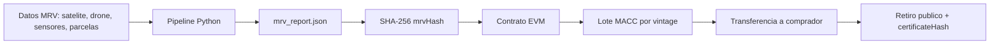

# Arquitectura - Manglar Azul MRV

## Flujo de datos

## Capas

1. MRV off-chain: consolida observaciones, aplica descuentos de fuga, incertidumbre y buffer.
2. Evidencia: genera `mrv_report.json` y `mrvHash` reproducible.
3. Contrato: registra proyectos, emite lotes, transfiere balances y retira creditos.
4. Demo/UI: muestra el flujo completo para una presentacion funcional.

## Roles

- Owner: administra proyectos y roles.
- Oracle MRV: actualiza hashes de evidencia.
- Certifier: emite lotes despues de validar MRV.
- Steward: custodio o comunidad del proyecto.
- Buyer: compra y retira creditos.

## Decisiones tecnicas

- Se usa un contrato EVM autocontenido para reducir dependencias durante el hackathon.
- Cada lote representa un vintage y una evidencia MRV especifica.
- La evidencia pesada queda off-chain; el hash on-chain permite auditoria y comparacion.
- El retiro reduce balance y registra un recibo publico para evitar doble uso.

## Riesgos y mitigaciones

| Riesgo | Mitigacion |
| --- | --- |
| MRV no certificado | Requiere verificador externo antes de emision productiva |
| Doble conteo | Retiro on-chain por lote y evento `CreditRetired` |
| Perdida de evidencia | Publicar metadata en IPFS/Filecoin o almacenamiento redundante |
| Roles centralizados | Migrar ownership a multisig/DAO en version piloto |
| Error de contrato | Auditoria, pruebas y despliegue por fases |
